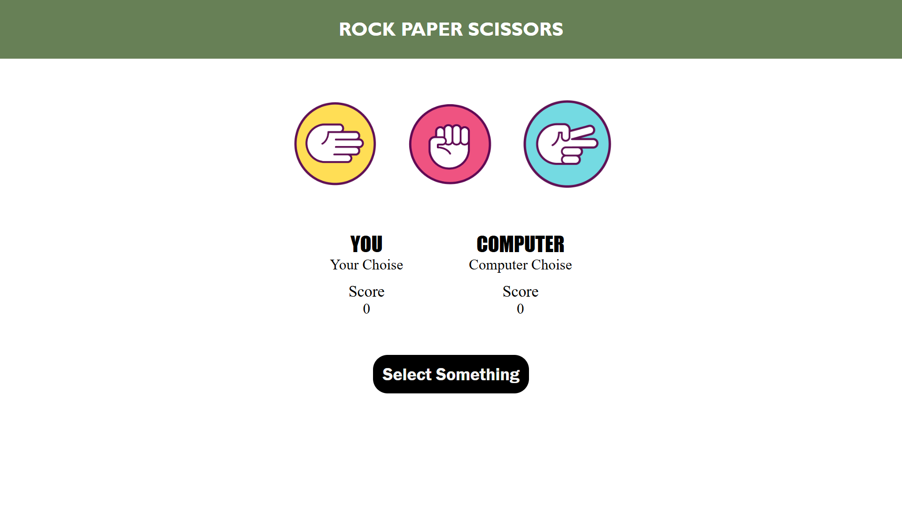

# Rock Paper Scissor Game 🎮

This is a simple web-based **Rock-Paper-Scissors** game built with HTML, CSS, and JavaScript.

## 🕹️ How to Play

1. Open `index.html` in a browser.
2. Click on **Rock**, **Paper**, or **Scissor**.
3. The computer will randomly choose a move.
4. The result (Win/Lose/Draw) will be displayed instantly.

## 📁 Project Structure

```
Rock paper scissor/
├── index.html        # Main HTML file
├── style.css         # Styling for the UI
└── script.js         # Game logic
```

## 🚀 Features

- Interactive UI
- Random computer choices
- Score tracking (if implemented)
- Fast and responsive gameplay

## 📸 Screenshot



## 📦 How to Run

No installation required. Just:

1. Download or clone the repository:
   ```bash
   git clone https://github.com/kartikeytripathi10/Rock-Paper-Scissor.git
   ```
2. Open `index.html` in your browser.

## 📜 License

This project is open source and free to use.

---

Made with ❤️ by [kartikeytripathi10](https://github.com/kartikeytripathi10)
